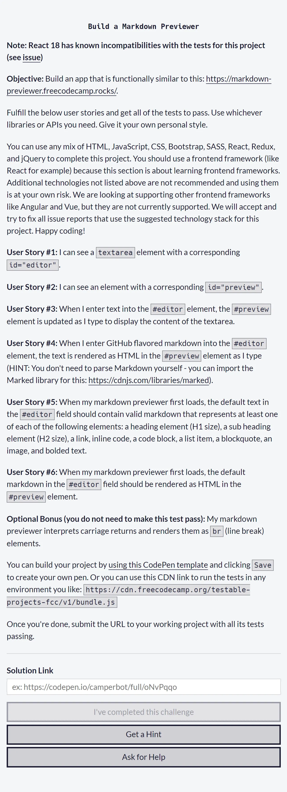
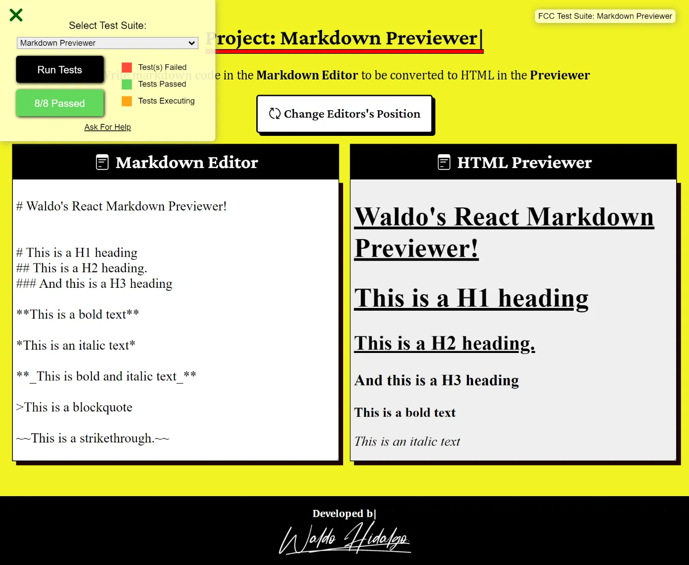
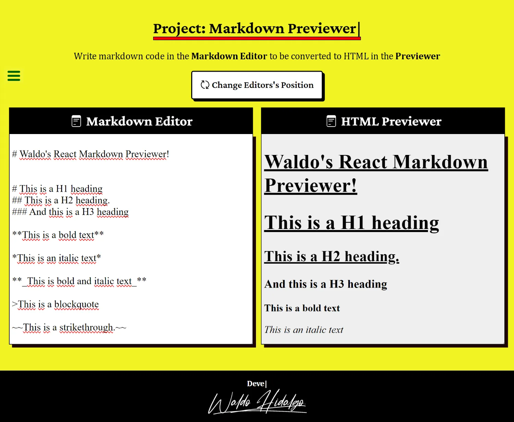
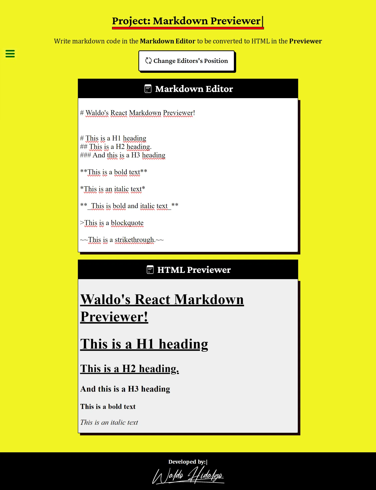
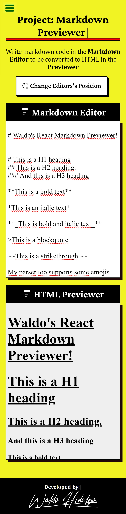

# Código Solución del Proyecto Markdown Previewer

El presente repositorio contiene el código solución del proyecto número dos, requisito para obtener la certificación [**Front End Development Libraries**](https://www.freecodecamp.org/learn/front-end-development-libraries/front-end-development-libraries-projects/build-a-markdown-previewer) de Freecodecamp.

- [Código Solución del Proyecto Markdown Previewer](#código-solución-del-proyecto-markdown-previewer)
  - [Objetivo](#objetivo)
  - [Requisitos](#requisitos)
  - [Librerías Utilizadas](#librerías-utilizadas)
  - [Proyecto Aprobado](#proyecto-aprobado)
  - [Screenshots adicionales](#screenshots-adicionales)
    - [Proyecto en pantallas grandes con dos columnas](#proyecto-en-pantallas-grandes-con-dos-columnas)
    - [Proyecto en pantallas grandes con una columna](#proyecto-en-pantallas-grandes-con-una-columna)
    - [Proyecto en pantallas small](#proyecto-en-pantallas-small)
- [Código Markdown utilizado como placeholder](#código-markdown-utilizado-como-placeholder)
  - [Waldo's React Markdown Previewer!](#waldos-react-markdown-previewer)
  - [This is a H1 heading](#this-is-a-h1-heading)
    - [This is a H2 heading.](#this-is-a-h2-heading)
      - [And this is a H3 heading](#and-this-is-a-h3-heading)
      - [Javascript](#javascript)
      - [HTML](#html)
      - [CSS](#css)
      - [Handlebars](#handlebars)
      - [Python](#python)
      - [JSX](#jsx)
      - [Java](#java)
      - [SQL](#sql)

## Objetivo

Construir un convertidor de Markdown a código HTML en el flavor de Github

## Requisitos



## Librerías Utilizadas

| Tecnologías Utilizadas |
| ---------------------- |
| Nextjs 12              |
| React 17               |
| ReactDom 17            |
| React Icons            |
| Marked                 |
| Marked-highlight       |
| Marked-emoji           |
| Dompurify              |
| Highlight.js           |
| Typewriter-effect      |

## Proyecto Aprobado

A continuación muestro la imagen del proyecto en el cual apruebo **TODOS** los test requeridos por Freecodecamp:



## Screenshots adicionales

### Proyecto en pantallas grandes con dos columnas



### Proyecto en pantallas grandes con una columna



### Proyecto en pantallas small



# Código Markdown utilizado como placeholder

A continuación muestro el código markdown convertido a HTML que he utilizado como placeholder en el Markdown Editor:

## Waldo's React Markdown Previewer!

## This is a H1 heading

### This is a H2 heading.

#### And this is a H3 heading

**This is a bold text**

_This is an italic text_

**_This is bold and italic text_**

> This is a blockquote

~~This is a strikethrough.~~

My parser too supports some emojis :tada: :

-That is so funny! :joy:  
-That is so cool! :tada:
-Go to space!: :rocket:

This is a link to emoji github code: [Github emoji code](https://gist.github.com/rxaviers/7360908)

This is a ordered list:

1. First item

2. Second item

3. Third item

This is an unordered list:

- First item

- Second item

- Third item

This is a inline code: `<p>Hello</p>`, between 2 backticks.

That are some code blocks:

#### Javascript

```js
document.getElementById("demo").innerHTML = "John Doe";
```

#### HTML

```html
<h1>Hello World!</h1>
```

#### CSS

```css
.titulo {
  color: red;
  text-align: center;
}
```

#### Handlebars

```hbs
{{> Header}}
```

#### Python

```python
fruits = ["apple", "banana", "cherry"]
for x in fruits:
print(x)
```

#### JSX

```jsx
const element = <a href="https://www.reactjs.org"> link </a>;
```

#### Java

```java
class HelloWorld {
public static void main(String args[])
{
System.out.println("Hello, World");
}
}
```

#### SQL

```sql
SELECT * FROM helloworld WHERE phrase = "Hello, World!";
```

This is a link: [Next.js Documentation](https://nextjs.org/docs)

And if you want to get really crazy, even tables:

| Name  | Last Name | Age |
| ----- | --------- | --- |
| Waldo | Hidalgo   | 34  |
| John  | Doe       | 32  |
| Jane  | Doe       | 28  |

And if you want to add a task list:

- [x] Write the press release
- [ ] Update the website
- [ ] Contact the media


